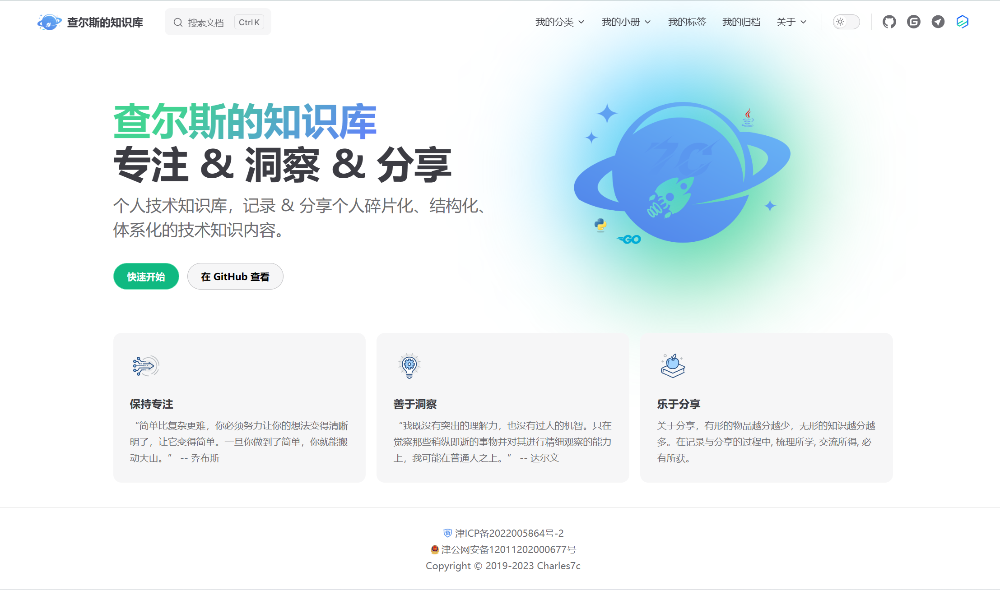

# 知识库

📝 **个人技术知识库，记录 & 分享个人碎片化、结构化、体系化的技术知识内容。**

## 开始

```bash
# 1.克隆本仓库
git clone https://github.com/pandaJS404/docs.git
# 2.安装 PNPM
npm install pnpm -g
# 3.安装 VitePress
npm install vitepress -g
# 4.安装依赖
pnpm install
# 5.dev 运行，访问：http://localhost:8888
pnpm dev
# 6.打包，文件存放位置：docs/.vitepress/dist
# 如果是部署到 GitHub Pages，可以利用 GitHub Actions，在 push 到 GitHub 后自动部署打包
# 详情见：.github/workflows/deploy-pages.yml，根据个人需要删减工作流配置
pnpm build
# 7.部署
# git push 到 GitHub 仓库，部署到 GitHub Pages：需要在仓库设置中启用 GitHub Pages
```

## 已扩展功能（持续优化细节）

- [x] 拆分配置文件：解决“大”配置文件问题，提取公有配置选项进行复用，方便维护

- [x] GitHub Actions：push 到 GitHub，自动进行项目打包及 GitHub Pages 部署

- [x] 自动生成侧边栏：将文章按规律性目录存放后，侧边栏将自动生成，支持文章置顶 🔝（在文章 frontmatter 中配置 `isTop: true`，即可在侧边栏自动出现置顶分组）

- [x] 文章元数据信息显示：文章标题下显示是否原创、作者、发布时间、所属分类、标签列表等信息，可全局配置作者及作者主页信息

- [x] 《我的标签》：模仿语雀标签页风格，另有标签云展示。

- [x] 《我的归档》：自定义时间轴，展示历史文章数据。年份前可展示生肖，还可按分类、标签筛选

- [x] 文章评论：目前仅支持 valine 评论插件，后续可增加更多评论插件支持

- [x] 版权声明：文末显示原创或转载文章的版权声明，可自由配置采用的版权协议

- [x] 本地文档搜索支持：VitePress 官方目前仅提供了对接 algolia 的在线搜索配置，而且对接起来的流程也较为麻烦。所幸寻到一个本地文档搜索插件 [emersonbottero/vitepress-plugin-search](https://github.com/emersonbottero/vitepress-plugin-search)。目前对接了 [vitepress-plugin-pagefind](https://www.npmjs.com/package/vitepress-plugin-pagefind) 本地搜索插件，中文搜索相对友好一些，如需体验，可将 `docs/vite.config.ts` 文件中的注释去除掉。目前 VitePress 官方有一个 PR 正在处理离线搜索功能，再过段时间应该就能合并了，到时候体验一下试试看。

注意：本地文档搜索和 algolia 搜索无法同时使用，开启本地文档搜索后 algolia 搜索配置将不再生效。

- [x] Mermaid 流程图：在 Markdown 中绘制流程图、状态图、时序图、甘特图、饼图等，更多语法请参见：[Mermaid 官方文档](https://github.com/mermaid-js/mermaid/blob/develop/README.zh-CN.md) 。（Typora 编辑器也支持 `mermaid` 语法）

- [x] Markdown 脚注、Markdown 公式支持

- [x] 文章内图片增加圆角样式优化

- [x] 侧边栏分组中的文章列表增加序号显示

<!-- ## 部分页面截图 -->

<!-- ### 主页美化 -->

<!--  -->

<!-- ### 侧边栏置顶分组（自动生成侧边栏及置顶分组）

### 文章元数据信息 -->

### 特别鸣谢

- [vuejs/vitepress](https://github.com/vuejs/vitepress) （本知识库基于 VitePress 构建）
- [vitejs/vite](https://github.com/vitejs/vite) （参考主页美化）
- [windicss/docs](https://github.com/windicss/docs) （参考配置文件拆分）
- [clark-cui/vitepress-blog-zaun](https://github.com/clark-cui/vitepress-blog-zaun) （参考文章标签的数据处理方案）
- [xiaoxian521/pure-admin-utils-docs](https://github.com/xiaoxian521/pure-admin-utils-docs) （参考词云组件的使用）
- [arco-design/arco-design-vue](https://github.com/arco-design/arco-design-vue) （使用部分组件及图标）
- [antvis/G2plot](https://github.com/antvis/G2plot) （使用部分图表）
- [emersonbottero/vitepress-plugin-mermaid](https://github.com/emersonbottero/vitepress-plugin-mermaid) （VitePress Mermaid 流程图插件）
- [mermaid-js/mermaid](https://github.com/mermaid-js/mermaid/blob/develop/README.zh-CN.md)
- ......

## License

- 文章遵循[CC 4.0 BY-SA](http://creativecommons.org/licenses/by-sa/4.0/)版权协议，转载请附上原文出处链接和声明
- 源码遵循 [MIT](https://github.com/pandaJS404/docs.github.io/blob/main/LICENSE) 许可协议
- Copyright © 2024-present PandaJS
