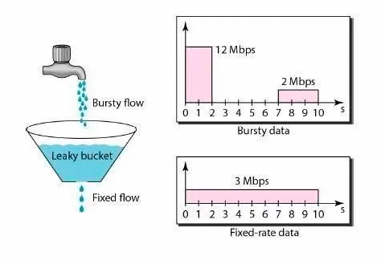
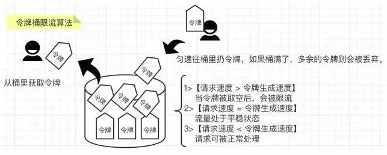
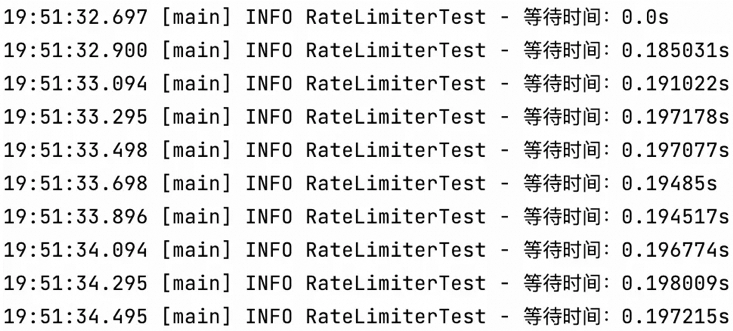
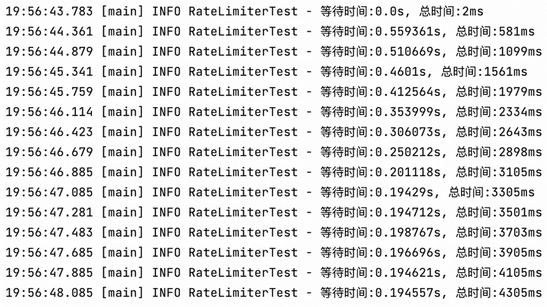

# 一文详解限流接口实现

本文介绍的实现方式属于应用级限制，应用级限流方式只是单应用内的请求限流，不能进行全局限流。要保证系统的抗压能力，限流是一个必不可少的环节，虽然可能会造成某些用户的请求被丢弃，但相比于突发流量造成的系统宕机来说，这些损失一般都在可以接受的范围之内。。

<!-- more -->

## 前言

### 为什么要进行限流？

- 瞬时流量过高，服务被压垮？

- 恶意用户高频光顾，导致服务器宕机？

- 消息消费过快，导致数据库压力过大，性能下降甚至崩溃？

  ……

### 什么是限流？

::: tip 什么是限流
限流是对某一时间窗口内的请求数进行限制，保持系统的可用性和稳定性，防止因流量暴增而导致的系统运行缓慢或宕机。
:::

在高并发系统中，出于系统保护角度考虑，通常会对流量进行限流。在分布式系统中，高并发场景下，为了防止系统因突然的流量激增而导致的崩溃，同时保证服务的高可用性和稳定性，限流是最常用的手段。

### 有哪些限流算法？

常见的四种限流算法，分别是：固定窗口算法、滑动窗口算法、漏桶算法、令牌桶算法。

## 限流算法

### 固定窗口

固定窗口又称固定窗口（又称计数器算法，Fixed Window）限流算法，是最简单的限流算法。

#### 实现原理

在指定周期内累加访问次数，当访问次数达到设定的阈值时，触发限流策略，当进入下一个时间周期时进行访问次数的清零。如图所示，我们要求 3 秒内的请求不要超过 150 次：


#### 代码实现

```java
public class FixedWindowRateLimiter {
    Logger logger = LoggerFactory.getLogger(FixedWindowRateLimiter.class);
    // 时间窗口大小，单位毫秒
    long windowSize;
    // 允许通过的请求数
    int maxRequestCount;
    // 当前窗口通过的请求数
    AtomicInteger counter = new AtomicInteger(0);
    // 窗口右边界
    long windowBorder;
    public FixedWindowRateLimiter(long windowSize, int maxRequestCount) {
        this.windowSize = windowSize;
        this.maxRequestCount = maxRequestCount;
        this.windowBorder = System.currentTimeMillis() + windowSize;
    }
    public synchronized boolean tryAcquire() {
        long currentTime = System.currentTimeMillis();
        if (windowBorder < currentTime) {
            logger.info("window reset");
            do {
                windowBorder += windowSize;
            } while (windowBorder < currentTime);
            counter = new AtomicInteger(0);
        }

        if (counter.intValue() < maxRequestCount) {
            counter.incrementAndGet();
            logger.info("tryAcquire success");
            return true;
        } else {
            logger.info("tryAcquire fail");
            return false;
        }
    }
}
```

#### 优缺点

**优点：** 实现简单，容易理解

**缺点：**

1. 限流不够平滑。例如：限流是每秒 3 个，在第一毫秒发送了 3 个请求，达到限流，窗口剩余时间的请求都将会被拒绝，体验不好。

2. 无法处理窗口边界问题。因为是在某个时间窗口内进行流量控制，所以可能会出现窗口边界效应，即在时间窗口的边界处可能会有大量的请求被允许通过，从而导致突发流量。即：如果第 2 到 3 秒内产生了 150 次请求，而第 3 到 4 秒内产生了 150 次请求，那么其实在第 2 秒到第 4 秒这两秒内，就已经发生了 300 次请求了，远远大于我们要求的 3 秒内的请求不要超过 150 次这个限制，如下图所示：

   

### 滑动窗口

滑动窗口为固定窗口的改良版，解决了固定窗口在窗口切换时会受到两倍于阈值数量的请求。在滑动窗口算法中，窗口的起止时间是动态的，窗口的大小固定。这种算法能够较好地处理窗口边界问题，但是实现相对复杂，需要记录每个请求的时间戳。

#### 实现原理

滑动窗口在固定窗口的基础上，将时间窗口进行了更精细的分片，将一个窗口分为若干个等份的小窗口，每次仅滑动一小块的时间。每个小窗口对应不同的时间点，拥有独立的计数器，当请求的时间点大于当前窗口的最大时间点时，则将窗口向前平移一个小窗口（将第一个小窗口的数据舍弃，第二个小窗口变成第一个小窗口，当前请求放在最后一个小窗口），整个窗口的所有请求数相加不能大于阈值。其中，Sentinel 就是采用滑动窗口算法来实现限流的。如图所示：


**核心步骤：**

1. 把 3 秒钟划分为 3 个小窗，每个小窗限制请求不能超过 50 秒。
2. 比如我们设置，3 秒内不能超过 150 个请求，那么这个窗口就可以容纳 3 个小窗，并且随着时间推移，往前滑动。每次请求过来后，都要统计滑动窗口内所有小窗的请求总量。

#### 代码实现

```java

public class SlidingWindowRateLimiter {
    Logger logger = LoggerFactory.getLogger(FixedWindowRateLimiter.class);
    // 时间窗口大小，单位毫秒
    long windowSize;
    // 分片窗口数
    int shardNum;
    // 允许通过的请求数
    int maxRequestCount;
    // 各个窗口内请求计数
    int[] shardRequestCount;
    // 请求总数
    int totalCount;
    // 当前窗口下标
    int shardId;
    // 每个小窗口大小，毫秒
    long tinyWindowSize;
    // 窗口右边界
    long windowBorder;

    public SlidingWindowRateLimiter(long windowSize, int shardNum, int maxRequestCount) {
        this.windowSize = windowSize;
        this.shardNum = shardNum;
        this.maxRequestCount = maxRequestCount;
        this.shardRequestCount = new int[shardNum];
        this.tinyWindowSize = windowSize / shardNum;
        this.windowBorder = System.currentTimeMillis();
    }
    public synchronized boolean tryAcquire() {
        long currentTime = System.currentTimeMillis();
        if (windowBorder < currentTime) {
            logger.info("window reset");
            do {
                shardId = (++shardId) % shardNum;
                totalCount -= shardRequestCount[shardId];
                shardRequestCount[shardId] = 0;
                windowBorder += tinyWindowSize;
            } while (windowBorder < currentTime);
        }

        if (totalCount < maxRequestCount) {
            logger.info("tryAcquire success:{}", shardId);
            shardRequestCount[shardId]++;
            totalCount++;
            return true;
        } else {
            logger.info("tryAcquire fail");
            return false;
        }
    }
}
```

#### 优缺点

**优点：** 解决了固定窗口算法的窗口边界问题，避免突发流量压垮服务器。
**缺点：** 还是存在限流不够平滑的问题。例如：限流是每秒 3 个，在第一毫秒发送了 3 个请求，达到限流，剩余窗口时间的请求都将会被拒绝，体验不好。

### 漏桶算法

漏桶限流算法是一种常用的流量整形（Traffic Shaping）和流量控制（Traffic Policing）的算法，它可以有效地控制数据的传输速率以及防止网络拥塞。

**主要的作用：**

1. 控制数据注入网络的速度。
2. 平滑网络上的突发流量

#### 实现原理

漏桶是一个很形象的比喻，外部请求就像是水一样不断注入水桶中，而水桶已经设置好了最大出水速率，漏桶会以这个速率匀速放行请求，而当水超过桶的最大容量后则被丢弃。不管上面的水流速度有多块，漏桶水滴的流出速度始终保持不变。消息中间件就采用的漏桶限流的思想。如图所示：



**核心步骤：**

1. 一个固定容量的漏桶，按照固定速率出水（处理请求）；
2. 当流入水（请求数量）的速度过大会直接溢出（请求数量超过限制则直接拒绝）。
3. 桶里的水（请求）不够则无法出水（桶内没有请求则不处理）。

#### 代码实现

```java
public class LeakyBucketRateLimiter {
    Logger logger = LoggerFactory.getLogger(LeakyBucketRateLimiter.class);
    // 桶的容量
    int capacity;
    // 桶中现存水量
    AtomicInteger water = new AtomicInteger();
    // 开始漏水时间
    long leakTimestamp;
    // 水流出的速率，即每秒允许通过的请求数
    int leakRate;

    public LeakyBucketRateLimiter(int capacity, int leakRate) {
        this.capacity = capacity;
        this.leakRate = leakRate;
    }

    public synchronized boolean tryAcquire() {
        // 桶中没有水， 重新开始计算
        if (water.get() == 0) {
            logger.info("start leaking");
            leakTimestamp = System.currentTimeMillis();
            water.incrementAndGet();
            return water.get() < capacity;
        }
        // 先漏水，计算剩余水量
        long currentTime = System.currentTimeMillis();
        int leakedWater = (int) ((currentTime - leakTimestamp) / 1000 * leakRate);
        logger.info("lastTime:{}, currentTime:{}. LeakedWater:{}", leakTimestamp, currentTime, leakedWater);
        // 可能时间不足，则先不漏水
        if (leakedWater != 0) {
            int leftWater = water.get() - leakedWater;
            // 可能水已漏光。设为0
            water.set(Math.max(0, leftWater));
            leakTimestamp = System.currentTimeMillis();
        }
        logger.info("剩余容量:{}", capacity - water.get());
        if (water.get() < capacity) {
            logger.info("tryAcquire sucess");
            water.incrementAndGet();
            return true;
        } else {
            logger.info("tryAcquire fail");
            return false;
        }
    }
}
```

#### 优缺点

**优点：**

1. 平滑流量。由于漏桶算法以固定的速率处理请求，可以有效地平滑和整形流量，避免流量的突发和波动（类似于消息队列的削峰填谷的作用）。
2. 防止过载。当流入的请求超过桶的容量时，可以直接丢弃请求，防止系统过载。

**缺点：**

1. 无法处理突发流量：由于漏桶的出口速度是固定的，无法处理突发流量。例如，即使在流量较小的时候，也无法以更快的速度处理请求。
2. 可能会丢失数据：如果入口流量过大，超过了桶的容量，那么就需要丢弃部分请求。在一些不能接受丢失请求的场景中，这可能是一个问题。
3. 不适合速率变化大的场景：如果速率变化大，或者需要动态调整速率，那么漏桶算法就无法满足需求。
4. 资源利用率：不管当前系统的负载压力如何，所有请求都得进行排队，即使此时服务器的负载处于相对空闲的状态，这样会造成系统资源的浪费。

由于漏桶的缺陷比较明显，所以在实际业务场景中，使用的比较少。

### 令牌算法

令牌桶算法是基于漏桶算法的一种改进，主要在于令牌桶算法能够在限制服务调用的平均速率的同时，还能够允许一定程度内的突发调用。

#### 实现原理

1. 系统以固定的速率向桶中添加令牌；

2. 当有请求到来时，会尝试从桶中移除一个令牌，如果桶中有足够的令牌，则请求可以被处理或数据包可以被发送；

3. 如果桶中没有令牌，那么请求将被拒绝；

4. 桶中的令牌数不能超过桶的容量，如果新生成的令牌超过了桶的容量，那么新的令牌会被丢弃。

5. 令牌桶算法的一个重要特性是，它能够应对突发流量。当桶中有足够的令牌时，可以一次性处理多个请求，这对于需要处理突发流量的应用场景非常有用。但是又不会无限制的增加处理速率导致压垮服务器，因为桶内令牌数量是有限制的。

如图所示：



#### 代码实现

Guava 中的 RateLimiter 就是基于令牌桶实现的，可以直接拿来使用。

#### 优缺点

**优点：**

1. 可以处理突发流量：令牌桶算法可以处理突发流量。当桶满时，能够以最大速度处理请求。这对于需要处理突发流量的应用场景非常有用。

2. 限制平均速率：在长期运行中，数据的传输率会被限制在预定义的平均速率（即生成令牌的速率）。
3. 灵活性：与漏桶算法相比，令牌桶算法提供了更大的灵活性。例如，可以动态地调整生成令牌的速率。

**缺点：**

1. 可能导致过载：如果令牌产生的速度过快，可能会导致大量的突发流量，这可能会使网络或服务过载。

2. 需要存储空间：令牌桶需要一定的存储空间来保存令牌，可能会导致内存资源的浪费。

3. 实现稍复杂：相比于计数器算法，令牌桶算法的实现稍微复杂一些。

## 应用实践

Guava 中的 RateLimiter 就是基于令牌桶实现的，可以直接拿来使用。所有整个实践是基于 Guava 的应用。

### 引入依赖

```xml
<dependency>
    <groupId>com.google.guava</groupId>
    <artifactId>guava</artifactId>
    <version>32.1.3-jre</version>
</dependency>
```

### API 直接使用

**固定产生令牌：**

```java
@Test
public void acquireTest() {
    // 每秒固定生成5个令牌
    RateLimiter rateLimiter = RateLimiter.create(5);
    for (int i = 0; i < 10; i++) {
        double time = rateLimiter.acquire();
        logger.info("等待时间：{}s", time);
    }
}
```



可以看到，每 200ms 左右产生一个令牌并放行请求，也就是 1 秒放行 5 个请求，使用 RateLimiter 能够很好的实现单机的限流。

**同时产生多个令牌：**

那么再回到我们前面提到的突发流量情况，令牌桶是怎么解决的呢？RateLimiter 中引入了一个预消费的概念。

申请令牌的数量不同不会影响这个申请令牌这个动作本身的响应时间，acquire(1)和 acquire(1000)这两个请求会消耗同样的时间返回结果，但是会影响下一个请求的响应时间。

如果一个消耗大量令牌的任务到达空闲的 RateLimiter，会被立即批准执行，但是当下一个请求进来时，将会额外等待一段时间，用来支付前一个请求的时间成本。

至于为什么要这么做，通过举例来引申一下。当一个系统处于空闲状态时，突然来了 1 个需要消耗 100 个令牌的任务，那么白白等待 100 秒是毫无意义的浪费资源行为，那么可以先允许它执行，并对后续请求进行限流时间上的延长，以此来达到一个应对突发流量的效果。

```java
@Test
public void acquireSmoothly() {
    RateLimiter rateLimiter = RateLimiter.create(5, 3, TimeUnit.SECONDS);
    long startTimeStamp = System.currentTimeMillis();
    for (int i = 0; i < 15; i++) {
        double time = rateLimiter.acquire();
        logger.info("等待时间:{}s, 总时间:{}ms", time, System.currentTimeMillis() - startTimeStamp);
    }
}
```



可以看到，令牌发放时间从最开始的 500ms 多逐渐缩短，在 3 秒后达到了 200ms 左右的匀速发放。

总的来说，基于令牌桶实现的 RateLimiter 功能还是非常强大的，在限流的基础上还可以把请求平均分散在各个时间段内，因此在单机情况下它是使用比较广泛的限流组件。

### AOP 切面

第一步：创建注解

```java
@Retention(RetentionPolicy.RUNTIME)
@Target({ElementType.METHOD})
@Documented
public @interface Limit {
    // 资源主键
    String key() default "";
    // 最多访问次数,代表请求总数量
    double permitsPerSeconds();
    // 时间：即timeout时间内,只允许有permitsPerSeconds个请求总数量访问，超过的将被限制不能访问
    long timeout();
    // 时间类型
    TimeUnit timeUnit() default TimeUnit.MILLISECONDS;
    // 提示信息
    String msg() default "系统繁忙,请稍后重试";
}
```

第二步：AOP 切面实现

```java
@Aspect
@Component
public class LimitAspect {
    Logger logger = LoggerFactory.getLogger(LimitAspect.class);
    private final Map<String, RateLimiter> limitMap = Maps.newConcurrentMap();

    @Around("@annotation(com.alibaba.xxx.xxx.annotation.Limit)")
    public Object around(ProceedingJoinPoint joinPoint) throws Throwable {
        MethodSignature signature = (MethodSignature) joinPoint.getSignature();
        Method method = signature.getMethod();
        // 拿limit的注解
        Limit limit = method.getAnnotation(Limit.class);
        if (limit != null) {
            // key作用：不同的接口，不同的流量控制
            String key = limit.key();
            RateLimiter rateLimiter;
            // 验证缓存是否有命中key
            if (!limitMap.containsKey(key)) {
                // 创建令牌桶
                rateLimiter = RateLimiter.create(limit.permitsPerSeconds());
                limitMap.put(key, rateLimiter);
                logger.info("新建了令牌桶={},容量={}", key, limit.permitsPerSeconds());
            }
            rateLimiter = limitMap.get(key);
            // 拿令牌
            boolean acquire = rateLimiter.tryAcquire(limit.timeout(), limit.timeUnit());
            // 拿不到令牌，直接返回异常信息
            if (!acquire) {
                logger.debug("令牌桶={},获取令牌失败", key);
                throw new RuntimeException(limit.msg());
            }
        }
        return joinPoint.proceed();
    }
}
```

第三步：应用

```java
@Limit(key = "query", permitsPerSeconds = 1, timeout = 1, msg = "触发接口限流，请重试")
```

第四步：使用位置详解

若是放在 http 的 mapping 接口上，返回如下：

```json
{
  "timestamp": "2023-12-07 11:21:47",
  "status": 500,
  "error": "Internal Server Error",
  "path": "/table/query"
}
```

若是放在 service 服务的接口上，返回如下：

```json
{
  "code": -1,
  "message": "触发接口限流，请重试",
  "data": "fail"
}
```

## 总结

本文介绍的实现方式属于应用级限制，应用级限流方式只是单应用内的请求限流，不能进行全局限流。假设将应用部署到多台机器，我们需要分布式限流和接入层限流来解决这个问题。

总的来说，要保证系统的抗压能力，限流是一个必不可少的环节，虽然可能会造成某些用户的请求被丢弃，但相比于突发流量造成的系统宕机来说，这些损失一般都在可以接受的范围之内。前面也说过，限流可以结合熔断、降级一起使用，多管齐下，保证服务的可用性与健壮性。

## 扩展资料

1.源码解析:高性能限流器 Guava RateLimiter：<https://zhuanlan.zhihu.com/p/358822328?utm_id=0>

2.拦截器版:使用 Guava 实现限流器 ：<https://zhuanlan.zhihu.com/p/38100340>
