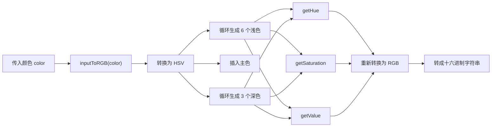

# genColor 函数拆解

在主题换肤、品牌色衍生、按钮状态色生成这类场景里，常见需求是“给定一个主色，自动生成一组可直接使用的色阶”。  
`gst-app` 中的 `genColor.ts` 正是为这个目的准备的工具函数。

它的输入是一个颜色字符串，输出是一组长度为 `10` 的十六进制颜色数组，顺序固定为：

```text
6 个浅色 + 1 个主色 + 3 个深色
```

## 项目中的实际输出

当前项目中可以直接看到的调试调用位于 `src/pages/about/index.vue`：

```ts
console.log('🚀 ~ genColor:', genColor('#0052d9'))
console.log('🚀 ~ genColor:', genColor('#001d66'))
```

其中 `#0052d9` 的实际输出结果如下：

```ts
[
  '#f0f9ff',
  '#cce8ff',
  '#a3d3ff',
  '#7abaff',
  '#4e98f2',
  '#2575e6',
  '#0052d9',
  '#003eb3',
  '#002c8c',
  '#001d66',
]
```

## 色板预览

### 项目主色 `#0052d9`

<div style="display:grid;grid-template-columns:repeat(auto-fit,minmax(92px,1fr));gap:12px;margin:16px 0;">
  <div style="overflow:hidden;border:1px solid #e5e7eb;border-radius:12px;background:#fff;"><div style="height:56px;background:#f0f9ff;"></div><div style="padding:8px;font-size:12px;line-height:1.5;"><strong>1</strong><br>#f0f9ff</div></div>
  <div style="overflow:hidden;border:1px solid #e5e7eb;border-radius:12px;background:#fff;"><div style="height:56px;background:#cce8ff;"></div><div style="padding:8px;font-size:12px;line-height:1.5;"><strong>2</strong><br>#cce8ff</div></div>
  <div style="overflow:hidden;border:1px solid #e5e7eb;border-radius:12px;background:#fff;"><div style="height:56px;background:#a3d3ff;"></div><div style="padding:8px;font-size:12px;line-height:1.5;"><strong>3</strong><br>#a3d3ff</div></div>
  <div style="overflow:hidden;border:1px solid #e5e7eb;border-radius:12px;background:#fff;"><div style="height:56px;background:#7abaff;"></div><div style="padding:8px;font-size:12px;line-height:1.5;"><strong>4</strong><br>#7abaff</div></div>
  <div style="overflow:hidden;border:1px solid #e5e7eb;border-radius:12px;background:#fff;"><div style="height:56px;background:#4e98f2;"></div><div style="padding:8px;font-size:12px;line-height:1.5;"><strong>5</strong><br>#4e98f2</div></div>
  <div style="overflow:hidden;border:1px solid #e5e7eb;border-radius:12px;background:#fff;"><div style="height:56px;background:#2575e6;"></div><div style="padding:8px;font-size:12px;line-height:1.5;"><strong>6</strong><br>#2575e6</div></div>
  <div style="overflow:hidden;border:1px solid #e5e7eb;border-radius:12px;background:#fff;"><div style="height:56px;background:#0052d9;"></div><div style="padding:8px;font-size:12px;line-height:1.5;"><strong>主色</strong><br>#0052d9</div></div>
  <div style="overflow:hidden;border:1px solid #e5e7eb;border-radius:12px;background:#fff;"><div style="height:56px;background:#003eb3;"></div><div style="padding:8px;font-size:12px;line-height:1.5;"><strong>8</strong><br>#003eb3</div></div>
  <div style="overflow:hidden;border:1px solid #e5e7eb;border-radius:12px;background:#fff;"><div style="height:56px;background:#002c8c;"></div><div style="padding:8px;font-size:12px;line-height:1.5;"><strong>9</strong><br>#002c8c</div></div>
  <div style="overflow:hidden;border:1px solid #e5e7eb;border-radius:12px;background:#fff;"><div style="height:56px;background:#001d66;"></div><div style="padding:8px;font-size:12px;line-height:1.5;"><strong>10</strong><br>#001d66</div></div>
</div>

这组颜色已经可以直接覆盖常见组件配色场景：

- `1 ~ 3`：背景色、提示底色、弱强调模块
- `4 ~ 6`：边框、浅色按钮、卡片高亮
- `7`：主按钮、品牌色、主链接
- `8 ~ 10`：hover、active、深色描边、深背景

## 使用方法

### 1. 基础调用

```ts
import { genColor } from '@/utils/genColor'

const colors = genColor('#0052d9')

console.log(colors)
```

返回结果是一个固定长度的数组：

```ts
[
  colors[0], // 最浅
  colors[1],
  colors[2],
  colors[3],
  colors[4],
  colors[5],
  colors[6], // 主色
  colors[7],
  colors[8],
  colors[9], // 最深
]
```

### 2. 拆成语义化变量

在实际项目里，推荐将数组拆成更清晰的语义变量，避免后续维护时频繁记忆下标。

```ts
import { genColor } from '@/utils/genColor'

const [
  primary1,
  primary2,
  primary3,
  primary4,
  primary5,
  primary6,
  primary,
  primary8,
  primary9,
  primary10,
] = genColor('#0052d9')
```

### 3. 生成主题变量

如果需要做主题切换或动态品牌色，可以先映射为一组 CSS 变量：

```ts
import { genColor } from '@/utils/genColor'

const colors = genColor('#0052d9')

const themeVars = {
  '--app-primary-1': colors[0],
  '--app-primary-2': colors[1],
  '--app-primary-3': colors[2],
  '--app-primary-4': colors[3],
  '--app-primary-5': colors[4],
  '--app-primary-6': colors[5],
  '--app-primary': colors[6],
  '--app-primary-8': colors[7],
  '--app-primary-9': colors[8],
  '--app-primary-10': colors[9],
}
```

如果运行在 H5 / 浏览器环境中，可以直接挂到根节点：

```ts
Object.entries(themeVars).forEach(([key, value]) => {
  document.documentElement.style.setProperty(key, value)
})
```

::: tip 说明
`document.documentElement` 这种写法适用于 H5 / Web 环境。  
如果运行在 `uni-app` 的小程序端或原生端，需要把这组颜色映射到对应平台的样式变量、主题配置或组件 props 中，而不是直接依赖 DOM。
:::

### 4. 页面样式中的具体使用

下面这个示例展示了主按钮、按下态按钮和浅色卡片的组合方式：

```ts
import { genColor } from '@/utils/genColor'

const colors = genColor('#0052d9')

const buttonStyle = {
  background: colors[6],
  borderColor: colors[6],
  color: '#fff',
}

const buttonActiveStyle = {
  background: colors[7],
  borderColor: colors[7],
  color: '#fff',
}

const cardStyle = {
  background: colors[0],
  border: `1px solid ${colors[2]}`,
  color: colors[6],
}
```

在 `Vue / uni-app` 中也可以直接绑定：

```vue
<script setup lang="ts">
import { genColor } from '@/utils/genColor'

const colors = genColor('#0052d9')

const cardStyle = {
  background: colors[0],
  border: `1px solid ${colors[2]}`,
  color: colors[6],
}

const buttonStyle = {
  background: colors[6],
  border: `1px solid ${colors[6]}`,
  color: '#fff',
}
</script>

<template>
  <view :style="cardStyle">浅色信息卡片</view>
  <button :style="buttonStyle">主按钮</button>
</template>
```

## 实现流程

`genColor` 的整体过程可以概括为下图：



## 核心常量

这段算法的输出风格，主要由以下常量控制：

| 常量 | 值 | 说明 |
| --- | --- | --- |
| `lightColorCount` | `6` | 生成 6 个浅色 |
| `darkColorCount` | `3` | 生成 3 个深色 |
| `saturationStep` | `0.16` | 浅色部分的饱和度下降步长 |
| `saturationStep2` | `0.05` | 深色部分的饱和度增加步长 |
| `brightnessStep1` | `0.05` | 浅色部分的亮度增加步长 |
| `brightnessStep2` | `0.15` | 深色部分的亮度下降步长 |
| `hueStep` | `2` | 每级色相的偏移幅度 |

## 核心实现拆解

### 1. RGB 转 HSV

颜色衍生逻辑没有直接在 RGB 空间里做，而是先转成 HSV。  
这样做的好处是可以分别控制：

- `H`：色相
- `S`：饱和度
- `V`：亮度

```ts
function toHsv({ r, g, b }: RgbObject): HsvObject {
  const hsv = rgbToHsv(r, g, b)
  return { h: hsv.h * 360, s: hsv.s, v: hsv.v }
}
```

其中 `hsv.h * 360` 将色相转换成角度制，后续计算更直观。

### 2. 色相处理：`getHue`

`getHue` 的作用不是“大幅换色”，而是让衍生色在亮暗变化过程中保留更自然的色相走向。

```ts
if (Math.round(hsv.h) >= 60 && Math.round(hsv.h) <= 240) {
  hue = light
    ? Math.round(hsv.h) - hueStep * i
    : Math.round(hsv.h) + hueStep * i
} else {
  hue = light
    ? Math.round(hsv.h) + hueStep * i
    : Math.round(hsv.h) - hueStep * i
}
```

可以总结为：

- 冷色区域在生成浅色时，色相略微减小
- 冷色区域在生成深色时，色相略微增大
- 暖色区域则采用相反方向

这种处理方式可以避免色板看起来只是单纯“加白”或“压黑”。

### 3. 饱和度处理：`getSaturation`

浅色和深色对饱和度的处理策略不同：

```ts
if (light) {
  saturation = hsv.s - saturationStep * i
} else if (i === darkColorCount) {
  saturation = hsv.s + saturationStep
} else {
  saturation = hsv.s + saturationStep2 * i
}
```

具体表现为：

- 浅色部分快速降饱和，避免高亮色过于刺眼
- 深色部分缓慢提饱和，避免变深后发灰
- 灰色 `h = 0 && s = 0` 时保持不变

同时还增加了边界修正：

- 最大值不超过 `1`
- 最浅一档饱和度高于 `0.1` 时直接压到 `0.1`
- 最低不小于 `0.06`

### 4. 亮度处理：`getValue`

亮度变化决定了色板的层次感：

```ts
if (light) {
  value = hsv.v + brightnessStep1 * i
} else {
  value = hsv.v - brightnessStep2 * i
}
```

可以看到两个明显特征：

- 浅色部分每级只增加 `0.05`
- 深色部分每级减少 `0.15`

这意味着深色区间的层次拉得更开，更适合用在按下态、深背景或强调边框。

### 5. 主函数：`genColor`

整个生成过程非常直接：

1. 生成 6 个浅色
2. 插入原始主色
3. 生成 3 个深色

```ts
export function genColor(color: string): string[] {
  const patterns: string[] = []
  const rgbColor = inputToRGB(color)

  for (let i = lightColorCount; i > 0; i -= 1) {
    const hsv = toHsv(rgbColor)
    patterns.push(toHex(inputToRGB({
      h: getHue(hsv, i, true),
      s: getSaturation(hsv, i, true),
      v: getValue(hsv, i, true),
    })))
  }

  patterns.push(toHex(rgbColor))

  for (let i = 1; i <= darkColorCount; i += 1) {
    const hsv = toHsv(rgbColor)
    patterns.push(toHex(inputToRGB({
      h: getHue(hsv, i),
      s: getSaturation(hsv, i),
      v: getValue(hsv, i),
    })))
  }

  return patterns
}
```

## 边界情况

当输入颜色本身已经非常暗时，深色部分会继续压低亮度。  
例如：

```ts
genColor('#001d66')
```

实际输出为：

```ts
[
  '#a8adb3',
  '#8594a6',
  '#627999',
  '#435f8c',
  '#294780',
  '#123173',
  '#001d66',
  '#001040',
  '#00061a',
  '#000000',
]
```

最后一档直接落到 `#000000`，原因在于 `getValue` 只限制了上限，没有限制下限：

```ts
if (value > 1) {
  value = 1
}
```

因此，当原色足够暗时，继续递减亮度会让末级颜色贴近纯黑。

## 代码观察

### 1. 注释位置与真实结果不一致

源码中有一条注释：

```ts
// 插入传入的颜色为数组第5个
```

但真实结果是 `6 个浅色 + 主色 + 3 个深色`，主色实际位于第 `7` 个位置，索引为 `6`。

### 2. `toHsv(rgbColor)` 可以提前计算

当前实现中，两个循环里都会重复执行：

```ts
const hsv = toHsv(rgbColor)
```

而 `rgbColor` 在整个函数中并没有变化，因此这一步完全可以提前计算一次，再在循环中复用结果。

## 总结

`genColor.ts` 的价值不在于简单地“把颜色调亮或调暗”，而在于它通过 HSV 三个维度的组合控制，生成了一套更适合实际 UI 设计使用的主题色板：

- 使用 `Hue` 控制色相微调
- 使用 `Saturation` 控制浅色和深色的纯度
- 使用 `Value` 控制层次和明暗变化

对于主题换肤、品牌色派生、按钮状态色、卡片背景色这类场景，这种实现方式具备较强的实用性，也更容易扩展成完整的主题系统。
